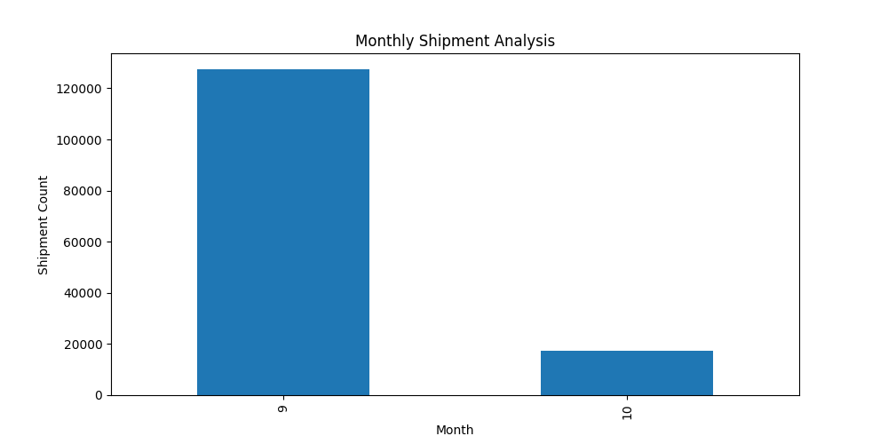
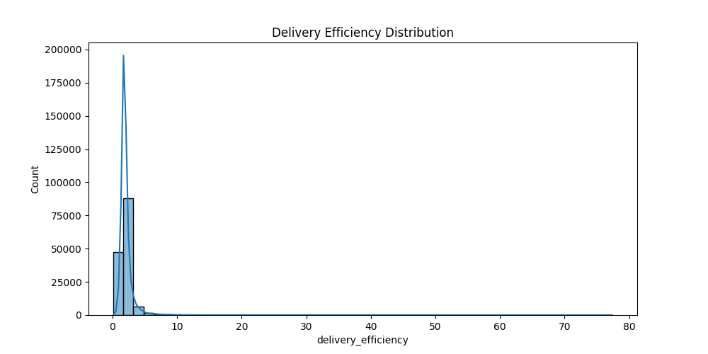
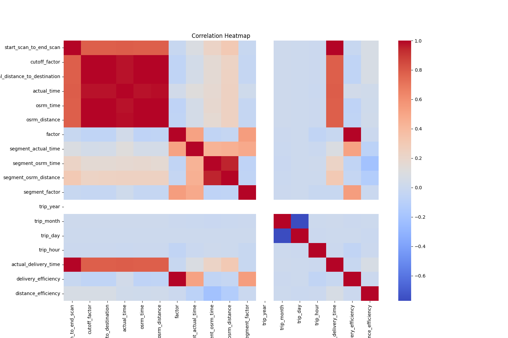
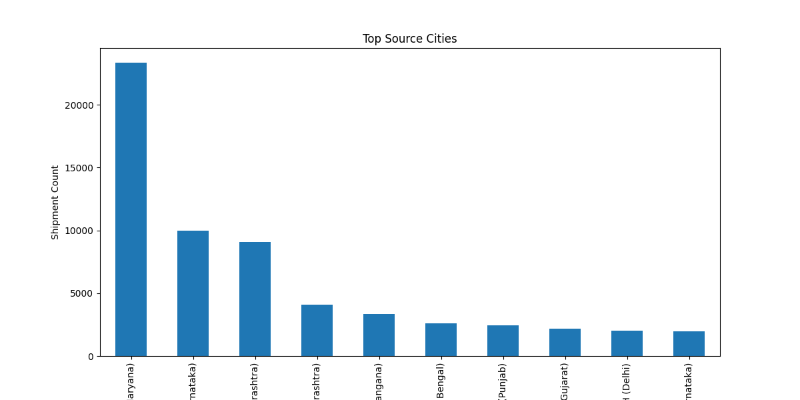
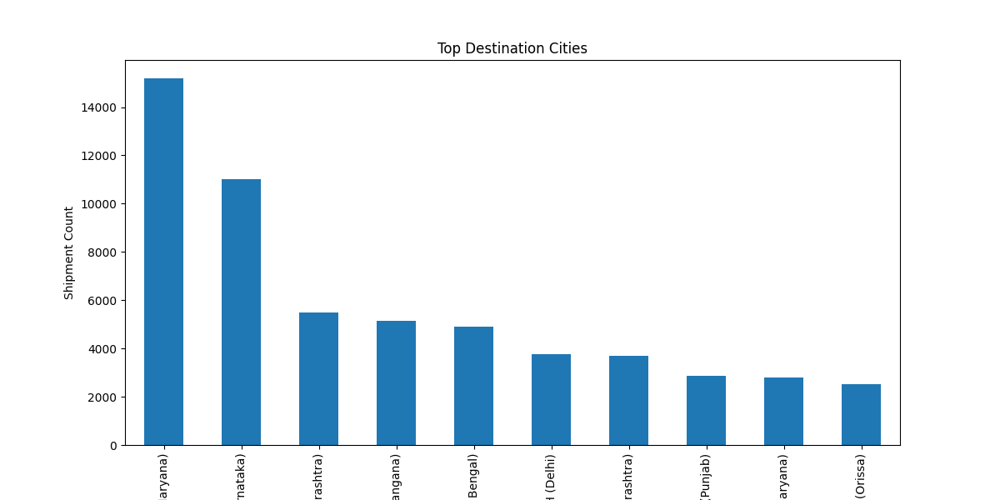

# Delhivery Feature Engineering & Logistics Analysis

## Project Overview

This project focuses on feature engineering, preprocessing, and operational analytics using logistics and delivery data from Delhivery.

The objective is to clean, transform, and engineer meaningful features from raw shipment and logistics datasets to improve operational visibility and enable downstream analytics and machine learning workflows.

---

# Business Problem

Delhivery handles large-scale logistics operations involving shipments, routes, delivery centers, and transportation timelines.

The analysis aims to:

- Improve delivery efficiency
- Identify operational bottlenecks
- Engineer logistics performance metrics
- Analyze delivery timelines
- Improve shipment tracking intelligence
- Prepare scalable ML-ready datasets

---

# Core Workflow

- Data Cleaning
- Missing Value Treatment
- Datetime Processing
- Route Analysis
- Aggregation Engineering
- Delivery Performance Analysis
- Feature Engineering
- Logistics KPI Analysis
- Operational Visualization

---

# Key Concepts Used

- Feature Engineering
- Data Transformation
- Aggregation Pipelines
- Datetime Analytics
- Logistics Intelligence
- Operational KPIs
- Data Preprocessing

---

# Tech Stack

- Python
- Pandas
- NumPy
- Matplotlib
- Seaborn
- Scikit-learn

---

# Project Status

🚧 Repository currently being rebuilt into a production-style feature engineering and logistics analytics project.
# Sample Visualizations

## Monthly Shipment Analysis

---

## Delivery Efficiency Distribution

---

## Correlation Heatmap

---

## Top Source Cities

---

## Top Destination Cities

