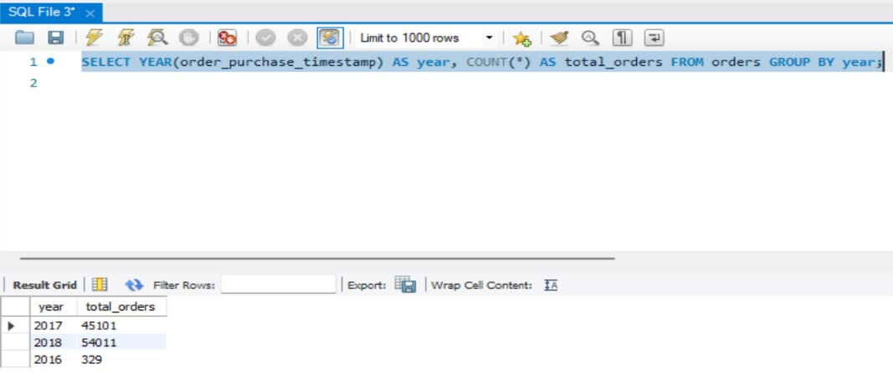
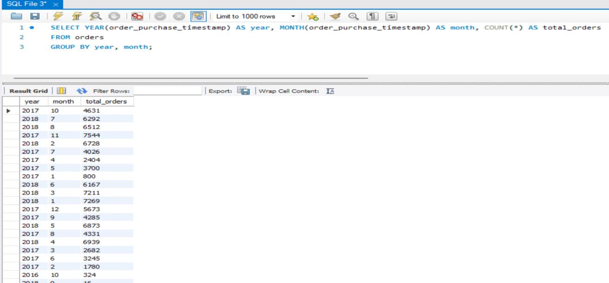
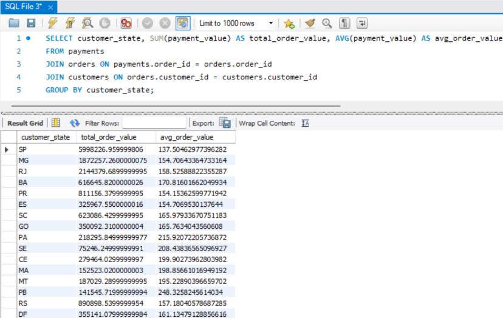
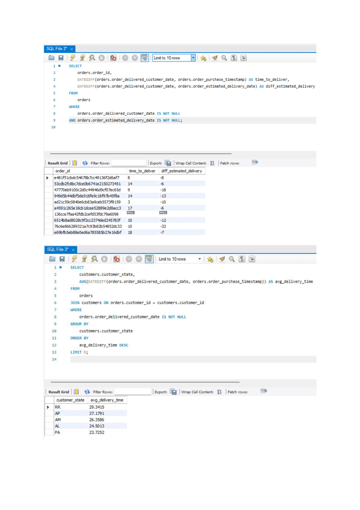
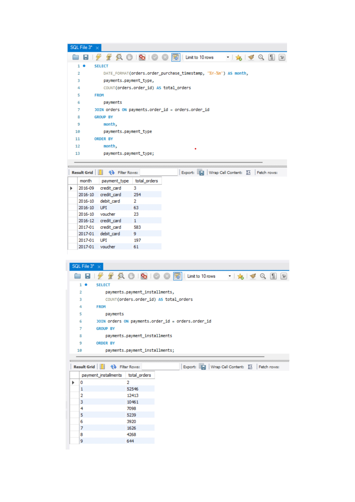

# Target Brazil SQL Analysis

## Project Overview

This project analyzes Target Brazil’s e-commerce operations using SQL-based analytics on transactional order data. The analysis focuses on customer behavior, order trends, payment methods, freight costs, delivery performance, and regional business patterns across Brazil.

The objective of this project is to simulate a real-world business analytics scenario where data-driven insights are used to improve operational efficiency, customer experience, and strategic decision-making.

---

# Business Problem

Target Brazil wants to better understand:

- Customer purchasing behavior
- Growth trends in e-commerce orders
- Regional sales distribution
- Delivery efficiency
- Freight cost patterns
- Payment preferences
- Logistics performance

Using SQL analytics, this project extracts actionable insights from large-scale e-commerce datasets.

---

# Dataset Information

The dataset contains information related to:

- Customers
- Orders
- Order Items
- Payments
- Freight Charges
- Delivery Dates
- Regional Information

The project analyzes Brazilian e-commerce transactions across multiple states and cities.

---

# SQL Concepts Used

This project demonstrates practical usage of:

- Joins
- Aggregations
- GROUP BY
- CASE Statements
- Common Business KPIs
- Date Functions
- DATEDIFF
- Sorting & Ranking
- Trend Analysis
- Time-based Analytics

---

# Analysis Performed

## 1. Data Exploration
- Customer distribution analysis
- Order purchase date range
- State and city analysis

## 2. Order Trend Analysis
- Yearly order growth
- Monthly seasonality
- Time-of-day ordering behavior

## 3. Customer & Regional Analysis
- State-wise customer distribution
- Month-on-month order trends

## 4. Economic Impact Analysis
- Revenue growth analysis
- Freight cost evaluation
- Average order value analysis

## 5. Delivery Performance Analysis
- Delivery time calculation
- Estimated vs actual delivery comparison
- Logistics performance evaluation

## 6. Payment Analysis
- Payment method trends
- Installment usage analysis
- Payment behavior insights

---

# Key Business Insights

- E-commerce orders showed significant year-over-year growth
- Afternoon and night periods recorded the highest customer activity
- Certain states experienced higher delivery times and freight costs
- Installment-based payments were widely preferred by customers
- Logistics inefficiencies varied significantly across regions

  
---


# Sample Analysis Screenshots

## Yearly Order Growth


---

## Monthly Seasonality Analysis


---

## Freight Cost Analysis


---

## Delivery Performance Analysis


---

## Payment Behavior Analysis


---

# Business Recommendations

- Optimize regional delivery operations
- Improve logistics efficiency in high-delay states
- Expand flexible installment payment options
- Implement targeted regional marketing campaigns
- Improve post-delivery customer feedback mechanisms

---

# Project Structure

```bash
target-brazil-sql-analysis/
│
├── README.md
├── sql/
├── screenshots/
├── results/
├── schema/
├── datasets/
└── 07_business_insights.md
```

---

# Tech Stack

- SQL
- MySQL
- Data Analytics
- Business Intelligence

---

# Future Improvements

- Build interactive Power BI/Tableau dashboards
- Automate reporting workflows
- Add advanced customer segmentation analysis
- Integrate predictive analytics workflows

---

# Author

Shubham Gupta  
AI Automation & ML Engineer
